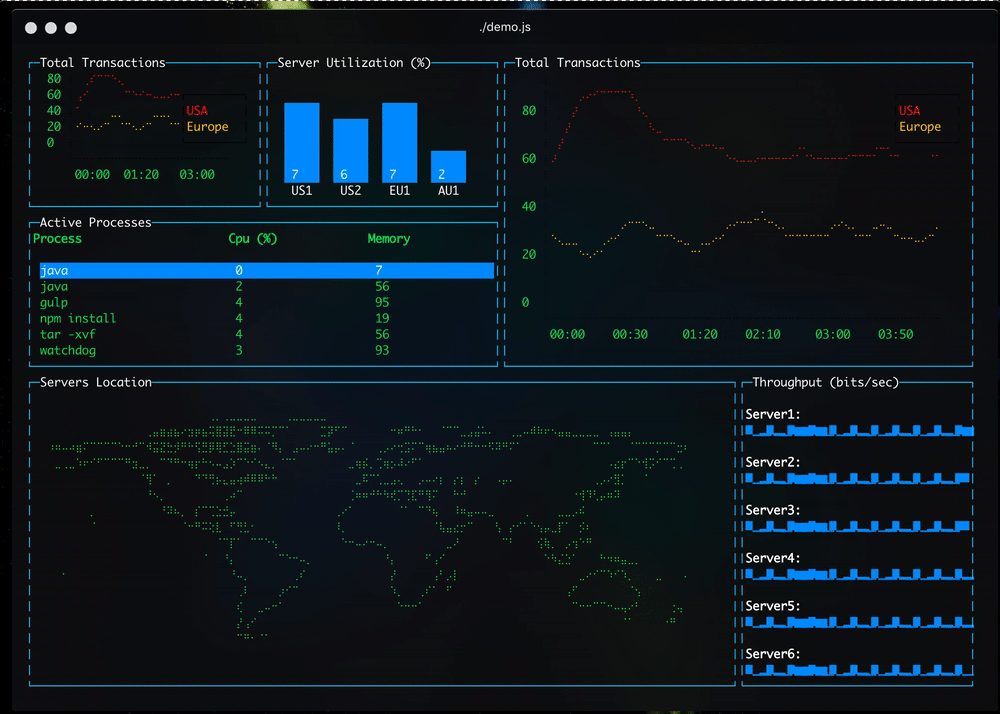

# 基于 Angular 与 Blessed 制作的命令行应用

## 参考文献

[AngularPlatform (一)](https://zhuanlan.zhihu.com/p/94570685)
[AngularPlatform (二)](https://zhuanlan.zhihu.com/p/94816548)
[AngularPlatform (三)](https://zhuanlan.zhihu.com/p/95032216)

## 概述

Angular 是一个设计很抽象化，很有想象力的框架，我们可以通过注入不同的实现，来实现我们各种我们想要实现的效果。

本 Demo 在 Angular9-12 版本均可运行
Mac 环境下已测试通过

本示例已经是所有包的最小依赖

效果图如下:


## 依赖版本

Node.JS 版本 14
Angular Cli 版本 12

## 裕兴

```
// 安装依赖
npm install

// 运行
npm start

// 在首次运行过程中 blessed-contrib 的 d.ts会提示错误
// 因此需要自行修复，偷懒的话可以直接把类型改为any
```

## 原理

通过提供自定义的 PlatformFactory、RenderFactory 的实现，并将他们注入到 DI 树中实现默认实现的替换。

## 坑点

1. 由于最后运行环境是 Node.JS 因此需要在 tsconfig.json 中设置 module 为 commonjs。否则默认是以 es6 标准模块进行转译
2. NG12 对应的 TS4.2.x 版本默认对类型要求更加严格，因此需要注意
3. 由于当前应用已经不再是 Browser，因此不能使用它默认的打包工具，只能通过 ngc 的方式直接进行编译，并且在此之前，需要使用 ngcc 将相关依赖进行预编译。

## 其他内容

... 后续施工中
